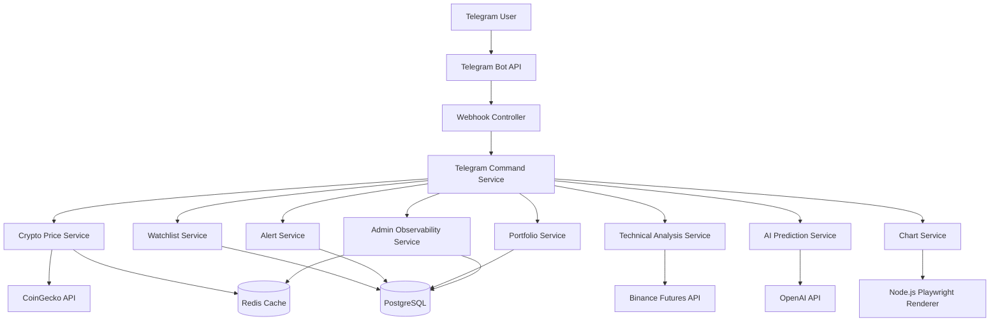

# Tracking Market Telegram Bot

Bot Telegram theo dõi thị trường crypto, hỗ trợ xem giá, biểu đồ, watchlist, alert, portfolio, phân tích kỹ thuật, AI quant analysis và các lệnh quản trị hệ thống.

Project này được xây dựng theo hướng backend thực tế: webhook, PostgreSQL, Redis cache, scheduled jobs, async processing, Resilience4j, observability và Docker Compose.

> Lưu ý: Bot chỉ phục vụ mục đích học tập, theo dõi thị trường và hỗ trợ phân tích. Nội dung từ bot không phải là lời khuyên đầu tư.

## Tính Năng Chính

- Nhận tin nhắn Telegram qua webhook.
- Xem giá crypto hiện tại, phần trăm thay đổi 24h, high/low và volume.
- Tạo biểu đồ crypto và idea chart bằng Node.js, Playwright, Lightweight Charts.
- Watchlist cá nhân theo từng user.
- Tự động gửi cập nhật watchlist theo lịch.
- Alert giá theo điều kiện lớn hơn, nhỏ hơn, lớn hơn hoặc bằng, nhỏ hơn hoặc bằng.
- Portfolio theo dõi lãi/lỗ theo entry mua hoặc bán.
- Daily Market Summary gửi mỗi sáng cho user đã bật.
- Trending crypto, top token, gainers, losers.
- USDT/VND rate từ Binance P2P.
- Technical analysis: RSI, EMA20, EMA50, volume delta, breakout, pivot trendline, order flow.
- Signal Score tổng hợp technical data thành điểm 0-100.
- AI Quant Market Analysis dùng OpenAI GPT-5 mini.
- Rate limit theo từng user để hạn chế spam command và bảo vệ chi phí OpenAI.
- Admin commands để kiểm tra DB, Redis, Circuit Breaker và thread pool metrics.

## Tech Stack

| Nhóm | Công nghệ |
| --- | --- |
| Backend | Java 21, Spring Boot 4 |
| Telegram | Telegram Bot API Webhook |
| Database | PostgreSQL, Spring Data JPA, Flyway |
| Cache | Redis, Spring Cache |
| Resilience | Resilience4j Retry, Circuit Breaker, Rate Limiter |
| Async | Spring Async, ThreadPoolTaskExecutor |
| Scheduler | Spring Scheduler, ThreadPoolTaskScheduler |
| Chart Renderer | Node.js, Playwright, Lightweight Charts |
| AI | OpenAI GPT-5 mini |
| Infra local | Docker Compose |
| Observability | Spring Actuator, admin bot commands |

## Cấu Trúc Thư Mục

```text
src/main/java/com/example/trackingbot
├── client          # Client gọi CoinGecko, Binance, OpenAI
├── config          # Cấu hình app, async, scheduler, properties
├── controller      # Webhook endpoint nhận update từ Telegram
├── dto             # Request/response DTO
├── entity          # JPA entity
├── repository      # Spring Data JPA repository
└── service
    ├── admin       # Admin health, metrics, thread pool observability
    ├── alert       # Price alert và scheduled checker
    ├── analysis    # Technical analysis, order flow, AI, signal score
    ├── chart       # Idea chart renderer
    ├── crypto      # Price, chart, trending, USDT/VND
    ├── daily       # Daily market summary
    ├── portfolio   # Portfolio P/L
    ├── telegram    # Command router, message sender, async sender
    └── watchlist   # Watchlist và auto update
```

## Yêu Cầu Cài Đặt

- Java 21
- Maven Wrapper đã có sẵn trong project
- Docker Desktop
- Node.js và npm
- Ngrok hoặc domain HTTPS public để dùng Telegram webhook
- Telegram Bot Token từ BotFather
- OpenAI API key nếu dùng `/ai` và `/ai_chart`

## Cấu Hình Môi Trường

Tạo file `.env` ở root project. Không commit file này lên GitHub.

```env
TELEGRAM_BOT_TOKEN=your_telegram_bot_token
TELEGRAM_WEBHOOK_SECRET=your_webhook_secret
TELEGRAM_ADMIN_CHAT_ID=your_admin_chat_id

OPENAI_API_KEY=your_openai_api_key
OPENAI_MODEL=gpt-5-mini

POSTGRES_URL=jdbc:postgresql://localhost:5432/tracking_bot
POSTGRES_USER=tracking_bot
POSTGRES_PASSWORD=tracking_bot_password
```

`.gitignore` đã chặn `.env`, `.env.*`, `target/`, `node_modules/` và `.idea/`.

## Chạy Local

### 1. Chạy PostgreSQL và Redis

```bash
docker compose up -d
```

Kiểm tra container:

```bash
docker ps
```

### 2. Cài dependency Node cho chart renderer

```bash
npm install
npm run install:browsers
```

### 3. Chạy test

```bash
./mvnw test
```

### 4. Chạy Spring Boot

```bash
./mvnw spring-boot:run
```

App mặc định chạy ở:

```text
http://localhost:8080
```

## Cấu Hình Telegram Webhook

Chạy ngrok:

```bash
ngrok http 8080
```

Sau đó set webhook:

```bash
curl "https://api.telegram.org/bot<TELEGRAM_BOT_TOKEN>/setWebhook?url=https://your-domain.ngrok-free.app/telegram/webhook&secret_token=<TELEGRAM_WEBHOOK_SECRET>"
```

Kiểm tra webhook:

```bash
curl "https://api.telegram.org/bot<TELEGRAM_BOT_TOKEN>/getWebhookInfo"
```

## Danh Sách Command

### Market Data

```text
/crypto BTC
/crypto_chart BTC 7d
/trending
/usdt
/val 1 BTC
```

### Chart Và Phân Tích

```text
/idea BTC
/chart_volume BTC
/chart_breakout BTC
/chart_trendline BTC
/chart_orderflow BTC
/signal BTC
```

### AI Analysis

```text
/ai BTC
/ai_chart BTC
```

### Watchlist

```text
/watch BTC
/unwatch BTC
/mywatchlist
/watch_updates_on
/watch_updates_off
```

### Alert

```text
/alert BTC > 70000
/notif BTC 100000
/myalerts
/delete_alert ALERT_ID
```

### Portfolio

```text
/buy BTC 0.1 65000
/buy BTC 65000
/sell BTC 61600
/myportfolio
```

### Daily Summary

```text
/daily_on
/daily_off
```

### Admin

```text
/admin_health
/admin_metrics
```

Admin commands chỉ hoạt động khi `TELEGRAM_ADMIN_CHAT_ID` trùng với `chat_id` của owner.

## Kiến Trúc Tổng Quan



Xem tài liệu chi tiết tại [docs/ARCHITECTURE.md](docs/ARCHITECTURE.md).

## Database

Database được quản lý bằng Flyway migration.

Các bảng chính:

- `telegram_users`: lưu user Telegram.
- `watchlist_items`: lưu watchlist từng user.
- `price_alerts`: lưu alert giá.
- `portfolio_positions`: lưu vị thế portfolio.
- `daily_settings`: lưu cấu hình daily summary và watchlist update.

## Cache

Redis được dùng qua Spring Cache.

Ví dụ:

- Cache giá crypto trong 60 giây.
- Cache chart/AI/trending data tùy service.

Cấu hình TTL:

```yaml
spring:
  cache:
    redis:
      time-to-live: 60s
```

## Resilience

Project dùng Resilience4j để bảo vệ khi external API lỗi hoặc bị rate limit.

Áp dụng cho:

- CoinGecko
- Binance Futures
- Binance P2P
- OpenAI

Các pattern đang dùng:

- Retry: thử lại request lỗi tạm thời.
- Circuit Breaker: ngắt tạm thời khi API lỗi liên tục.
- Rate Limiter: giới hạn tốc độ gọi API.

## User Command Rate Limit

Ngoài Resilience4j cho external APIs, bot còn có rate limit theo từng Telegram user.

Giới hạn hiện tại:

- Mỗi user tối đa 10 command/phút.
- `/ai` tối đa 3 lần/phút.
- `/ai_chart` tối đa 2 lần/phút.

Mục tiêu:

- Tránh user spam command.
- Giảm rủi ro tốn quota OpenAI.
- Giảm áp lực lên external APIs.
- Trả message rõ ràng cho user biết cần chờ bao lâu trước khi thử lại.

## Scheduler Và Async Processing

Scheduled jobs:

- Check active alerts mỗi 1 phút.
- Gửi watchlist update mỗi 5 phút.
- Gửi daily summary lúc 08:00 giờ Việt Nam.

Project có custom scheduler pool:

```text
tracking-scheduler-*
```

Telegram message được gửi async qua executor riêng:

```text
telegram-async-*
```

Lợi ích:

- Scheduled job không bị block khi gửi nhiều message.
- Có queue xử lý message.
- Có thể theo dõi active thread, queue size và completed task qua `/admin_metrics`.

## Admin Observability

`/admin_health` trả trạng thái:

```text
DB: UP
Redis: UP
CoinGecko CB: CLOSED
Binance Futures CB: CLOSED
OpenAI CB: CLOSED
```

`/admin_metrics` trả:

```text
Users
Watchlist items
Active alerts
Daily subscribers
Portfolio positions
Circuit Breakers
Thread Pools
```

## Security Notes

- Không commit `.env`.
- Không commit token Telegram, OpenAI API key hoặc webhook secret.
- Nếu token từng bị lộ trong ảnh, log hoặc chat, nên rotate token mới.
- Admin commands nên luôn cấu hình `TELEGRAM_ADMIN_CHAT_ID`.

## Chạy Kiểm Tra Trước Khi Commit

```bash
./mvnw test
git status
```

Đảm bảo không commit:

```text
.env
.idea
target
node_modules
```

## Roadmap

- Mở rộng unit test cho command parsing và edge cases.
- Thêm alert nâng cao theo RSI, signal score và breakout.
- Triển khai production trên VPS với domain HTTPS cố định.
- Thêm dashboard metrics qua Prometheus/Grafana hoặc Actuator metrics.
