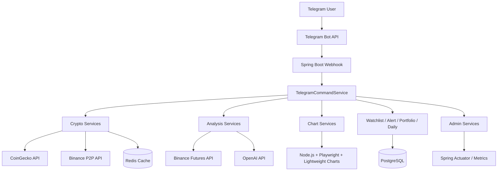
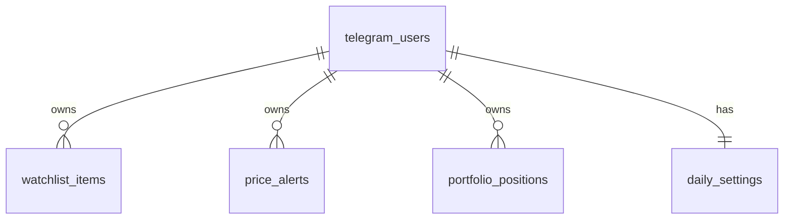

# Tracking Market Telegram Bot - Architecture Notes

Tài liệu này tổng hợp kiến thức chính trong project Tracking Market Telegram Bot. Mục tiêu là giúp bạn hiểu project đang chạy như thế nào, mỗi công nghệ dùng để giải quyết vấn đề gì, và khi đi phỏng vấn có thể giải thích rõ ràng thay vì chỉ nói "em có dùng Spring Boot".

> Bot phục vụ mục đích học tập, theo dõi thị trường và hỗ trợ phân tích. Nội dung bot trả về không phải lời khuyên đầu tư.

## 1. Bức Tranh Tổng Quan

Project là một Telegram bot backend viết bằng Spring Boot. User gửi command trên Telegram, Telegram gọi webhook của app, app xử lý command, lấy dữ liệu từ API ngoài, đọc/ghi database/cache, rồi gửi kết quả lại cho user.

Các nhóm tính năng chính:

- Market data: `/crypto`, `/trending`, `/usdt`, `/val`, `/tintuc`.
- Chart: `/crypto_chart`, `/idea`, `/chart_volume`, `/chart_breakout`, `/chart_trendline`, `/chart_orderflow`.
- Analysis: `/signal`, `/ai`, `/ai_chart`.
- User data: watchlist, alert, portfolio, daily summary.
- Admin/observability: `/admin_health`, `/admin_metrics`.



## 2. Luồng Xử Lý Một Command

Ví dụ user gửi:

```text
/crypto BTC
```

Luồng xử lý:

1. Telegram gửi HTTP POST tới endpoint webhook của Spring Boot.
2. `TelegramWebhookController` nhận update.
3. Controller chuyển text message sang `TelegramCommandService`.
4. `TelegramCommandService` kiểm tra rate limit theo user.
5. Service parse command `/crypto BTC`.
6. Gọi `CryptoPriceService`.
7. `CryptoPriceService` gọi `CoinGeckoClient`.
8. Kết quả được cache Redis 60 giây nếu có cấu hình cache.
9. App format message.
10. `TelegramMessageService` gửi message về Telegram.

Điểm quan trọng:

- Controller mỏng, không chứa logic nghiệp vụ.
- Command service đóng vai trò router.
- Business logic nằm trong service con.
- Client chỉ lo gọi API ngoài.
- Database/cache được đặt phía sau service, không gọi trực tiếp từ controller.

## 3. Cấu Trúc Package

```text
com.example.trackingbot
├── client          # Gọi API ngoài: CoinGecko, Binance, OpenAI
├── config          # Cấu hình properties, async, scheduler
├── controller      # Webhook endpoint
├── dto
│   ├── request     # Request DTO gửi tới API ngoài/Telegram
│   └── response    # Response DTO từ API ngoài hoặc output rõ nghĩa
├── entity          # JPA Entity map với PostgreSQL
├── model           # Object nghiệp vụ nội bộ
├── repository      # Spring Data JPA Repository
└── service
    ├── admin
    ├── alert
    ├── analysis
    ├── chart
    ├── crypto
    ├── daily
    ├── news
    ├── portfolio
    ├── telegram
    └── watchlist
```

Ý nghĩa từng nhóm:

- `controller`: nhận request HTTP từ Telegram.
- `service`: xử lý nghiệp vụ.
- `client`: gọi API ngoài, ví dụ Binance, CoinGecko, OpenAI.
- `entity`: class được JPA dùng để map bảng database.
- `repository`: interface truy vấn database.
- `dto/request`: dữ liệu gửi đi.
- `dto/response`: dữ liệu nhận về hoặc response object rõ nghĩa.
- `model`: dữ liệu nội bộ app tự tính toán, không phải request/response API.

Ví dụ phân biệt:

- `PriceAlertEntity` là JPA entity vì map bảng `price_alerts`.
- `CryptoPrice` là response vì đại diện dữ liệu giá lấy từ API.
- `SignalScore` là model vì app tự tính điểm tín hiệu nội bộ.

## 4. Database PostgreSQL

PostgreSQL dùng để lưu dữ liệu lâu dài của user.

Các dữ liệu cần lưu:

- Telegram user.
- Watchlist.
- Alert giá.
- Portfolio.
- Daily summary setting.

Các bảng chính:



Project dùng:

- Spring Data JPA để thao tác database bằng repository.
- Flyway để quản lý schema migration.
- `ddl-auto: validate` để Spring chỉ kiểm tra schema, không tự ý tạo/sửa bảng.

Điểm học được:

- JPA Entity không nên trộn với DTO.
- Repository chỉ nên truy vấn database, không format message.
- Migration giúp database có lịch sử thay đổi rõ ràng.
- `validate` an toàn hơn `update` khi project bắt đầu nghiêm túc.

## 5. Redis Cache

Redis dùng để cache dữ liệu ngắn hạn, đặc biệt là dữ liệu API ngoài hay bị gọi lặp.

Ví dụ:

- Giá crypto.
- Tin tức Telegram channel `/tintuc`.
- Dữ liệu chart hoặc market data phù hợp cache ngắn.

Cấu hình hiện tại:

```yaml
spring:
  cache:
    type: redis
    redis:
      time-to-live: 60s
```

Ý nghĩa:

- Nếu nhiều user cùng gọi `/crypto BTC`, app không cần gọi API ngoài liên tục.
- Cache giúp bot nhanh hơn.
- Cache giúp tránh rate limit từ API ngoài.
- Cache không thay thế database vì dữ liệu cache có thể hết hạn hoặc bị xóa.

Lưu ý quan trọng:

- Object lưu vào Redis cần serialize được.
- Nếu cache object custom bằng Java serialization, record đó nên `implements Serializable`.
- Dữ liệu realtime không nên cache quá lâu.

## 6. Scheduled Jobs

Project có các job chạy định kỳ bằng Spring Scheduler.

Các job chính:

- Alert checker: kiểm tra alert mỗi 1 phút.
- Watchlist update: gửi cập nhật watchlist mỗi 5 phút nếu user bật.
- Daily summary: gửi market summary mỗi sáng.

Ví dụ logic alert:

```text
Mỗi 1 phút
-> lấy danh sách active alerts
-> gọi giá hiện tại
-> so sánh giá với điều kiện alert
-> nếu đạt điều kiện thì gửi Telegram message
-> chuyển alert thành inactive
```

Điểm học được:

- Job định kỳ phù hợp với tác vụ tự động.
- Không nên để job gửi message đồng bộ quá nhiều, dễ nghẽn thread scheduler.
- Scheduler nên có thread pool riêng để nhiều job không chặn nhau.

## 7. Async Processing

Async dùng để gửi Telegram message không đồng bộ, nhất là trong background job.

Ví dụ:

- Watchlist update cần gửi tin cho nhiều user.
- Daily summary cần gửi nhiều message buổi sáng.
- Nếu gửi đồng bộ, một user bị chậm có thể làm chậm cả job.

Luồng hợp lý:

```text
Scheduler
-> tìm danh sách user cần gửi
-> gọi TelegramAsyncService
-> async thread gửi message qua TelegramMessageService
```

Điểm học được:

- `@Async` giúp tách việc nặng/chậm khỏi thread chính.
- Thread pool nên giới hạn số thread, queue, prefix name.
- Cần có admin metrics để biết thread pool đang bận hay nghẽn.

## 8. Resilience4j

Resilience4j bảo vệ app khi API ngoài lỗi, chậm hoặc bị rate limit.

Project dùng 3 pattern chính:

### Retry

Thử lại khi lỗi tạm thời.

Ví dụ:

```text
Gọi CoinGecko lỗi network
-> chờ 500ms
-> thử lại
-> tối đa 3 lần
```

Retry phù hợp với lỗi tạm thời, không nên retry quá nhiều vì có thể làm API ngoài bị spam.

### Circuit Breaker

Tạm ngắt gọi API nếu lỗi liên tục.

Ví dụ:

```text
OpenAI lỗi nhiều lần
-> Circuit Breaker OPEN
-> request sau fail nhanh
-> chờ một thời gian
-> chuyển HALF_OPEN để thử lại
-> nếu ổn thì CLOSED
```

Ý nghĩa:

- Không lãng phí tài nguyên khi API ngoài đang chết.
- Bot trả lỗi nhanh hơn thay vì treo lâu.
- Giúp hệ thống ổn định hơn.

### Rate Limiter

Giới hạn số request gửi tới API ngoài trong một khoảng thời gian.

Ví dụ:

- CoinGecko: giới hạn request theo period.
- OpenAI: giới hạn thấp hơn vì tốn tiền.
- Binance P2P: giới hạn để tránh bị chặn.

## 9. User Command Rate Limit

Ngoài rate limit API ngoài, project còn có rate limit theo từng Telegram user.

Mục tiêu:

- Chặn user spam command.
- Bảo vệ OpenAI cost.
- Giữ bot ổn định khi nhiều request cùng lúc.

Ví dụ rule:

```text
Mỗi user: tối đa 10 command/phút
/ai: tối đa 3 lần/phút
/ai_chart: tối đa 2 lần/phút
```

Điểm học được:

- Rate limit ở user layer khác với rate limit external API.
- User layer bảo vệ app khỏi hành vi spam.
- External API layer bảo vệ app khỏi lỗi/rate limit của bên thứ ba.

## 10. Technical Analysis

Project có nhóm `analysis` để tính dữ liệu trước khi format hoặc gửi sang AI.

Các dữ liệu phân tích:

- EMA20, EMA50.
- RSI14.
- Volume delta.
- Support/resistance.
- Breakout confirmation.
- Pivot high/pivot low.
- Trendline.
- Order flow.
- Signal score.

Nguyên tắc quan trọng:

- Bot không nên đoán giá từ không khí.
- Bot nên tính dữ liệu định lượng trước.
- AI chỉ nên tổng hợp và giải thích dựa trên dữ liệu đã tính.

Ví dụ input cho AI:

```text
Price
EMA20
EMA50
RSI
Volume delta
Support
Resistance
Breakout status
Trendline status
Order flow
```

Output AI:

```text
Bias: Bullish / Bearish / Neutral
Confidence
Market context
Quant evidence
Scenario
Invalidation
Risk management
```

## 11. Chart Renderer

Chart không render trực tiếp bằng Java. Project dùng:

- Node.js.
- Lightweight Charts.
- Playwright screenshot.

Luồng:

```text
Spring Boot service
-> chuẩn bị chart data
-> gọi script Node.js
-> script render chart bằng Lightweight Charts
-> Playwright chụp ảnh
-> Spring Boot gửi ảnh về Telegram
```

Vì sao làm như vậy:

- Lightweight Charts chạy tốt trong browser environment.
- Playwright giúp tạo ảnh chart tự động.
- Java tập trung vào backend logic, Node tập trung vào rendering.

## 12. Telegram Webhook

Bot dùng webhook thay vì polling.

Webhook nghĩa là:

```text
Telegram chủ động gọi API của app khi có message mới.
```

Ưu điểm:

- Gần realtime.
- Phù hợp backend deploy server.
- Học được flow HTTP callback thực tế.

Yêu cầu:

- App phải có public HTTPS URL.
- Local dev thường dùng ngrok.
- Cần set webhook bằng Telegram Bot API.

Endpoint chính:

```text
POST /telegram/webhook
```

## 13. News Feature

`/tintuc` lấy tin mới từ Telegram channel public.

Luồng:

```text
/tintuc
-> TelegramChannelNewsService
-> gọi trang public t.me/s/vncointele
-> parse HTML bằng Jsoup
-> format 5 tin/trang
-> gửi inline button Before/Next
```

Điểm học được:

- Jsoup dùng để parse HTML.
- Nên cache kết quả để tránh gọi liên tục.
- Pagination giúp message không quá dài.
- Khi cache record custom vào Redis, record cần serialize được.

## 14. Admin Và Observability

Project có command admin để kiểm tra hệ thống ngay trong Telegram.

Ví dụ:

```text
/admin_health
/admin_metrics
```

Thông tin nên quan sát:

- DB UP/DOWN.
- Redis UP/DOWN.
- Circuit Breaker state.
- Active alerts.
- Daily subscribers.
- Thread pool metrics.

Spring Actuator cũng được bật:

```text
/actuator/health
/actuator/metrics
```

Điểm học được:

- App chạy được là chưa đủ, cần biết app có khỏe không.
- Observability giúp debug nhanh hơn khi bot lỗi.
- Admin command tiện cho project Telegram vì không cần mở dashboard riêng.

## 15. Docker Compose

Docker Compose dùng để chạy infrastructure local.

Hiện tại gồm:

- PostgreSQL.
- Redis.

Command:

```bash
docker compose up -d
```

Ý nghĩa:

- Developer không cần cài PostgreSQL/Redis trực tiếp vào máy.
- Môi trường local dễ tái tạo.
- Dễ mở rộng sau này nếu muốn containerize cả Spring Boot app.

## 16. Testing

Project có unit test cho các service quan trọng:

- Alert service.
- Watchlist service.
- Portfolio service.
- Signal score service.
- User command rate limiter.
- News parser.

Lệnh chạy test:

```bash
./mvnw test
```

Kiến thức test chính:

- Unit test kiểm tra logic service mà không cần gọi API thật.
- Mock dùng để giả lập dependency.
- Test parser giúp tránh lỗi khi format HTML thay đổi nhẹ.
- Test rate limiter giúp chắc command spam bị chặn đúng.

## 17. Những Quyết Định Thiết Kế Quan Trọng

### Vì sao tách `entity`, `dto`, `model`?

- `entity`: gắn với database.
- `dto`: gắn với dữ liệu request/response.
- `model`: object nghiệp vụ nội bộ.

Tách rõ giúp code dễ đọc và tránh nhầm object lưu DB với object trả API.

### Vì sao cần Redis cache?

Market data bị gọi lặp rất nhiều. Cache 60 giây giúp giảm request ra ngoài và tăng tốc response.

### Vì sao cần PostgreSQL?

Watchlist, alert, portfolio, daily settings là dữ liệu lâu dài. Nếu chỉ lưu in-memory, restart app là mất.

### Vì sao AI không tự đoán giá?

AI nên tổng hợp dữ liệu đã tính, không nên tự bịa dự đoán. Cách tốt hơn là đưa dữ liệu định lượng cho AI rồi yêu cầu phân tích có điều kiện, invalidation và risk management.

### Vì sao cần scheduler?

Một số tính năng không chờ user gọi command:

- Alert phải tự kiểm tra.
- Daily summary phải tự gửi.
- Watchlist update phải tự gửi nếu user bật.

### Vì sao cần Resilience4j?

Bot phụ thuộc nhiều API ngoài. Nếu API ngoài lỗi, app cần retry vừa đủ, ngắt tạm thời khi lỗi nhiều và giới hạn request.

## 18. Kiến Thức Có Thể Ghi Vào CV

Bạn có thể mô tả project như sau:

```text
Built a Spring Boot Telegram bot for crypto market tracking with webhook integration,
PostgreSQL persistence, Redis caching, scheduled jobs, async message dispatch,
Resilience4j fault tolerance, OpenAI-powered market analysis, and Node.js/Playwright
chart rendering.
```

Các keyword kỹ thuật:

- Java 21, Spring Boot 4.
- Telegram Webhook.
- REST client integration.
- PostgreSQL, Spring Data JPA, Flyway.
- Redis cache.
- Scheduled jobs.
- Async processing, thread pool.
- Resilience4j Retry, Circuit Breaker, Rate Limiter.
- OpenAI API integration.
- Node.js, Playwright, Lightweight Charts.
- Unit testing with JUnit/Mockito.
- Docker Compose.
- Observability with Actuator and admin commands.

## 19. Hướng Phát Triển Tiếp Theo

Các hướng nâng cấp hợp lý:

- Chuyển user rate limiter từ in-memory sang Redis để hỗ trợ multi-instance.
- Thêm integration test với Testcontainers cho PostgreSQL/Redis.
- Thêm Dockerfile để containerize Spring Boot app.
- Thêm CI/CD GitHub Actions chạy test khi push.
- Thêm structured logging và correlation id.
- Thêm database index cho các query alert/watchlist nếu dữ liệu lớn.
- Thêm error tracking hoặc log aggregation khi deploy thật.
- Tách command handler thành nhiều class nhỏ nếu `TelegramCommandService` quá lớn.

## 20. Cách Giải Thích Project Trong Phỏng Vấn

Câu trả lời ngắn gọn:

```text
Project của em là Telegram bot theo dõi crypto market. Em dùng Spring Boot làm backend,
Telegram webhook để nhận tin nhắn realtime, PostgreSQL để lưu user/watchlist/alert/portfolio,
Redis để cache dữ liệu giá, scheduler để tự check alert và gửi daily summary, Resilience4j
để bảo vệ khi API ngoài lỗi, và OpenAI để tổng hợp phân tích thị trường dựa trên dữ liệu
kỹ thuật đã tính sẵn.
```

Câu trả lời khi được hỏi về kiến trúc:

```text
Em chia project theo layer. Controller chỉ nhận webhook. CommandService parse command và
điều phối. Các service con xử lý nghiệp vụ như crypto, alert, portfolio, analysis. Client
layer gọi API ngoài. Repository layer thao tác PostgreSQL. Redis cache nằm ở service/client
để giảm request lặp. Background jobs chạy bằng scheduler và gửi message async để không làm
nghẽn thread chính.
```

Câu trả lời khi được hỏi vì sao dùng Redis:

```text
Dữ liệu giá crypto thay đổi nhanh nhưng user có thể gọi lặp cùng một symbol trong vài giây.
Nếu request nào cũng gọi API ngoài thì chậm và dễ bị rate limit. Em cache ngắn khoảng 60 giây
để cân bằng giữa realtime và hiệu năng.
```

Câu trả lời khi được hỏi về Resilience4j:

```text
Vì bot phụ thuộc CoinGecko, Binance và OpenAI nên em dùng Retry cho lỗi tạm thời, Circuit
Breaker để ngắt khi API lỗi liên tục, và Rate Limiter để không gửi quá nhiều request ra ngoài.
Như vậy bot ổn định hơn và tránh tốn chi phí OpenAI khi user spam.
```
