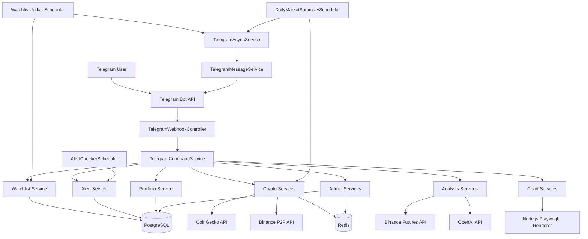
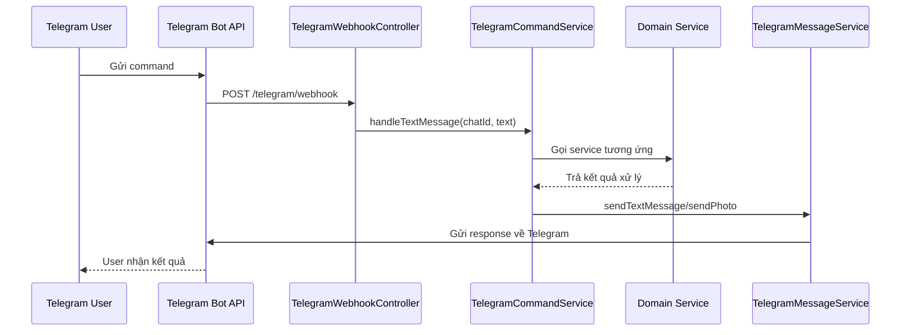
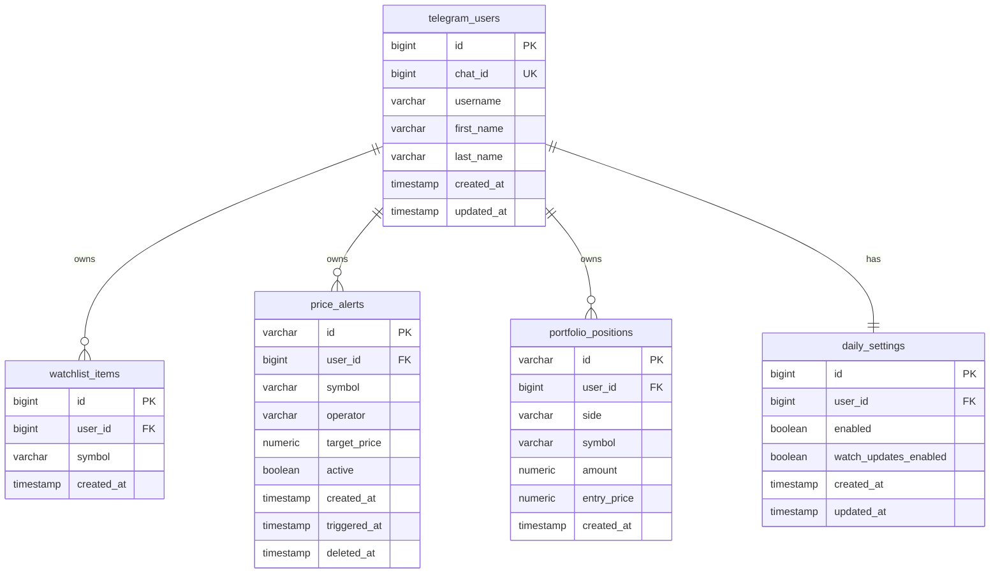
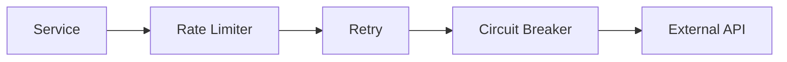
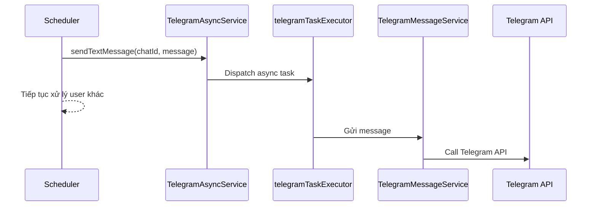

# Architecture Documentation

Tài liệu này mô tả kiến trúc của Tracking Market Telegram Bot, cách các module phối hợp với nhau và các quyết định kỹ thuật chính trong project.

## Mục Tiêu Hệ Thống

Bot được thiết kế để theo dõi thị trường crypto qua Telegram với các yêu cầu chính:

- Nhận command từ user bằng Telegram webhook.
- Lấy dữ liệu thị trường từ external APIs.
- Cache dữ liệu ngắn hạn để giảm số lần gọi API.
- Lưu dữ liệu user, watchlist, alert, portfolio và settings vào PostgreSQL.
- Chạy background jobs cho alert, daily summary và watchlist update.
- Gửi message bất đồng bộ để scheduler không bị nghẽn.
- Có cơ chế bảo vệ khi external API lỗi, chậm hoặc bị rate limit.
- Giới hạn command theo từng user để tránh spam và kiểm soát chi phí OpenAI.
- Có admin commands để quan sát trạng thái hệ thống.

## High-Level Architecture



## Luồng Xử Lý Webhook



Controller chỉ nên làm nhiệm vụ nhận update và chuyển tiếp. Logic command nằm trong `TelegramCommandService`. Logic nghiệp vụ nằm trong từng service con.

## Module Chính

### Controller

`TelegramWebhookController` nhận update từ Telegram.

Trách nhiệm:

- Nhận HTTP request từ Telegram webhook.
- Kiểm tra secret token nếu có cấu hình.
- Phân loại message hoặc callback query.
- Chuyển xử lý sang `TelegramCommandService`.

### Telegram Layer

Các class chính:

- `TelegramCommandService`
- `TelegramMessageService`
- `TelegramAsyncService`
- `TelegramUserService`

Trách nhiệm:

- Parse command.
- Gọi service tương ứng.
- Gửi text, photo, inline keyboard.
- Dispatch message bất đồng bộ cho các job gửi nhiều message.
- Lưu hoặc cập nhật thông tin Telegram user.

### Crypto Layer

Các class chính:

- `CryptoPriceService`
- `CryptoChartService`
- `TrendingCryptoService`
- `UsdtRateService`
- `ValueConversionService`

Trách nhiệm:

- Lấy giá crypto.
- Format price message.
- Tạo chart cơ bản.
- Lấy top trending.
- Lấy tỷ giá USDT/VND từ Binance P2P.
- Tính value theo USDT và VND.

### Analysis Layer

Các class chính:

- `TechnicalAnalysisService`
- `OrderFlowService`
- `SignalScoreService`
- `AiPredictionService`

Trách nhiệm:

- Tính EMA20, EMA50, RSI14.
- Tính volume delta.
- Xác định support, resistance và breakout.
- Tìm pivot high/pivot low để vẽ trendline.
- Phân tích order book, agg trades, open interest và funding rate.
- Tổng hợp Signal Score 0-100.
- Gửi dữ liệu đã tính sang OpenAI để tạo AI Quant Market Analysis.

### Chart Layer

Các class chính:

- `IdeaChartService`
- `scripts/render-idea-chart.js`

Trách nhiệm:

- Chuẩn bị dữ liệu chart.
- Gọi Node.js script.
- Render chart bằng Lightweight Charts.
- Chụp ảnh bằng Playwright.
- Gửi ảnh chart về Telegram.

### Persistence Layer

Các entity chính:

- `TelegramUser`
- `WatchlistItemEntity`
- `PriceAlertEntity`
- `PortfolioPositionEntity`
- `DailySettingEntity`

Các repository chính:

- `TelegramUserRepository`
- `WatchlistItemRepository`
- `PriceAlertRepository`
- `PortfolioPositionRepository`
- `DailySettingRepository`

Database schema được quản lý bằng Flyway trong:

```text
src/main/resources/db/migration
```

## Database Schema



## Cache Strategy

Redis được dùng qua Spring Cache.

Mục tiêu:

- Giảm số lần gọi CoinGecko/Binance/OpenAI.
- Tăng tốc phản hồi command thường dùng.
- Tránh user spam làm external API bị rate limit quá nhanh.

TTL mặc định:

```yaml
spring:
  cache:
    redis:
      time-to-live: 60s
```

Ví dụ:

- `/crypto BTC` có thể dùng cache 60 giây.
- Trending data có thể cache ngắn hạn.
- AI analysis có thể cache để tránh gọi OpenAI liên tục.

## Resilience Strategy

Project dùng Resilience4j cho external APIs.



Các API được bảo vệ:

- CoinGecko
- Binance Futures
- Binance P2P
- OpenAI

### Retry

Retry dùng cho lỗi tạm thời như network timeout hoặc HTTP client exception.

### Circuit Breaker

Circuit Breaker mở khi API lỗi liên tục, giúp bot không tiếp tục gọi API đang lỗi.

Trạng thái thường gặp:

- `CLOSED`: API đang ổn.
- `OPEN`: API đang lỗi nhiều, tạm ngưng gọi.
- `HALF_OPEN`: thử gọi lại một số request để kiểm tra API đã hồi phục chưa.

### Rate Limiter

Rate Limiter giới hạn tốc độ gọi API để giảm khả năng bị chặn hoặc vượt quota.

## User Command Rate Limiting

Project có thêm `UserCommandRateLimiter` ở Telegram layer.

Giới hạn hiện tại:

| Rule | Giới hạn |
| --- | --- |
| Tất cả command | 20 lần/phút/user |

Rate limiter được kiểm tra trong `TelegramCommandService` trước khi command đi vào các service nghiệp vụ.

Lý do thiết kế:

- Chặn spam từ một user cụ thể.
- Giảm áp lực ngắn hạn lên bot và API ngoài.

## Subscription Plan Và AI Quota

Các command dùng OpenAI được kiểm soát bằng quota theo plan trong PostgreSQL:

| Plan | AI quota |
| --- | --- |
| FREE | 5 lượt/ngày |
| PRO | 50 lượt/ngày |
| ADMIN | Unlimited |

Command:

- `/my_usage`: user xem plan và số lượt AI đã dùng hôm nay.
- `/admin_set_plan CHAT_ID PRO`: owner đổi plan cho user.

Flow:

```text
/ai hoặc /ai_chart
-> Redis rate limit chống spam
-> SubscriptionService kiểm tra ai_usage_quotas
-> Còn quota thì tăng used_count
-> Gọi OpenAI
```
- Giảm tải cho CoinGecko, Binance và chart renderer.
- Trả về thời gian chờ còn lại để user biết khi nào có thể thử lại.

Hiện tại rate limiter dùng in-memory state, phù hợp với local hoặc single-instance deployment. Nếu deploy nhiều instance, nên chuyển state sang Redis để các instance dùng chung cùng một quota.

## Scheduler Architecture

Project có 3 scheduled jobs chính:

| Job | Tần suất | Nhiệm vụ |
| --- | --- | --- |
| `AlertCheckerScheduler` | Mỗi 1 phút | Kiểm tra active alerts |
| `WatchlistUpdateScheduler` | Mỗi 5 phút | Gửi watchlist update |
| `DailyMarketSummaryScheduler` | 08:00 mỗi ngày | Gửi daily market summary |

Scheduler dùng custom thread pool:

```text
tracking-scheduler-*
```

Config nằm ở:

```text
SchedulerConfig
```

Lý do dùng custom scheduler:

- Tránh các scheduled jobs chặn lẫn nhau.
- Dễ debug thread name trong log.
- Có shutdown policy rõ ràng.
- Có thể đo active thread và queue size.

## Async Message Delivery

Daily summary và watchlist update có thể phải gửi nhiều message. Nếu gửi tuần tự trong scheduler, job sẽ bị block lâu.

Vì vậy project dùng:

```text
TelegramAsyncService
AsyncConfig
ThreadPoolTaskExecutor
```

Executor:

```text
telegram-async-*
```

Flow:



Lưu ý: `AlertCheckerScheduler` hiện vẫn gửi message trực tiếp trước khi mark alert triggered. Điều này giúp tránh trường hợp gửi fail nhưng alert đã bị tắt.

## Admin Observability

Admin commands giúp kiểm tra hệ thống ngay trong Telegram.

### `/admin_health`

Kiểm tra:

- PostgreSQL
- Redis
- Circuit Breaker status của CoinGecko, Binance, OpenAI

### `/admin_metrics`

Theo dõi:

- Users
- Watchlist items
- Active alerts
- Daily subscribers
- Portfolio positions
- Circuit Breaker metrics
- Scheduler pool metrics
- Telegram async executor metrics

Ví dụ:

```text
Thread Pools:
Status: OK
Scheduler: pool 4 | active 0 | queued 3 | completed 12
Telegram Async: pool 4/8 | active 0 | queued 0/100 | completed 25
```

## Security Design

Nguyên tắc:

- Không lưu secret trong source code.
- Dùng biến môi trường cho token và API key.
- `.env` bị chặn bởi `.gitignore`.
- Admin commands chỉ mở cho `TELEGRAM_ADMIN_CHAT_ID`.
- Webhook có thể kiểm tra `TELEGRAM_WEBHOOK_SECRET`.

Các biến nhạy cảm:

```text
TELEGRAM_BOT_TOKEN
TELEGRAM_WEBHOOK_SECRET
TELEGRAM_ADMIN_CHAT_ID
OPENAI_API_KEY
POSTGRES_PASSWORD
```

Nếu token từng bị lộ trong log, ảnh chụp màn hình hoặc chat, nên rotate token mới.

## Failure Scenarios

### CoinGecko hoặc Binance lỗi

Bot dùng Retry và Circuit Breaker. Nếu API lỗi liên tục, Circuit Breaker sẽ mở để giảm request thất bại.

### Redis lỗi

Cache có thể không hoạt động, nhưng dữ liệu vẫn có thể lấy từ API nếu service xử lý được cache miss.

### PostgreSQL lỗi

Các tính năng cần lưu dữ liệu như watchlist, alert, portfolio và daily settings sẽ bị ảnh hưởng.

### OpenAI lỗi hoặc hết quota

Các lệnh `/ai` và `/ai_chart` có thể fail, nhưng các lệnh market data khác vẫn hoạt động.

### Telegram API chậm

Daily summary và watchlist update được dispatch qua async executor, giúp scheduler không bị block quá lâu.

## Development Workflow

Trước khi commit:

```bash
./mvnw test
git status
```

Không commit:

```text
.env
.idea
.idea_backup
target
node_modules
```

Commit message nên mô tả rõ feature:

```bash
git commit -m "add async processing and admin observability"
```

## Roadmap Kỹ Thuật

Các hướng phát triển tiếp theo:

- Mở rộng unit tests cho command parsing và edge cases.
- Alert nâng cao theo RSI, breakout và signal score.
- Metrics export qua Micrometer, Prometheus và Grafana.
- Production deployment với VPS, Nginx, HTTPS và domain webhook cố định.
